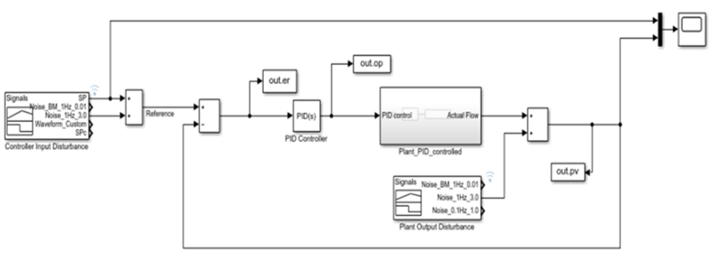
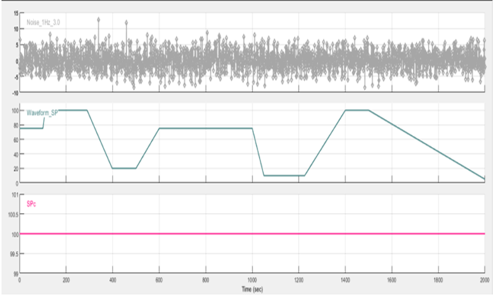

# Algorithm for the detection of Stiction and Backlash in control valves.

### This algorithm is used in conjunction with the calculation of indicators used in CLPM (Control Loop Performance Monitoring) programs. 
This program is based on research conducted by Tore Hagglund (2007:2011) for the detection of Stiction and Backlash, Choudhury (2004) and Siraskar (2021) for testing and application in simulation environments, and CLPM of General Electric (2020) in the use of indicators.

$$\textbf{Principal Equations}$$

$$\text{IAE Aplication :}  \quad IAE ={\int_{tc0}^{tc1}|e(t)|dt}$$

$$\text{Stiction Indicator}$$

$$Istic = \frac{Vsine - Vsquare}{Vsine + Vsquare}$$

$$\text{When \textbf{Vsine} and \textbf{Vsquare} are the probabily form.}$$

$$
Case:
\begin{array}{cc}  
    Istic  > 0 ; & \text{ Stiction.}\\
    Istic  < 0 ; & \text{ Others.}  
\end{array}
$$

$$\begin{matrix} \text{Backlash Estimation} \\  \\\\ \begin{align} d = {K \left(\frac{\Delta t}{Ti} - \frac{1}{KKp} * \Delta y\right)} \quad \end{align} \end{matrix}$$

$$
\text{Conditions:}
\begin{array}{cc}
    \Delta t \geq 5 * Ti \\  
    emax  < 2 * \Delta y
\end{array}
$$

$$\textbf{Modelo de Simulación Matlab/Simulink}$$

$$ \text{Model Plant} $$

$$\text{Plant Noise Data}$$

  

### Source:
 
1. Hagglund, T. (2007). Automatic on-line Estimation of Backlash In Control Loops. Journal of Process Control, 489–499. 
2. Hagglund, T. (2011). A shape-analysis approach for diagnosis of stiction in control valves. Control Engineering Practice, 782-789. 
3. Choudhury, M.A.A.S. (2004). Detection and quantification of control valve stiction. IFAC Proceedings Volumes, 37(9), 865–870. 
4. Siraskar, R. (2021). Reinforcement learning for control of valves. Machine Learning With Applications. 
5. General Electric. (2020). Control Loop Performance Monitoring.

